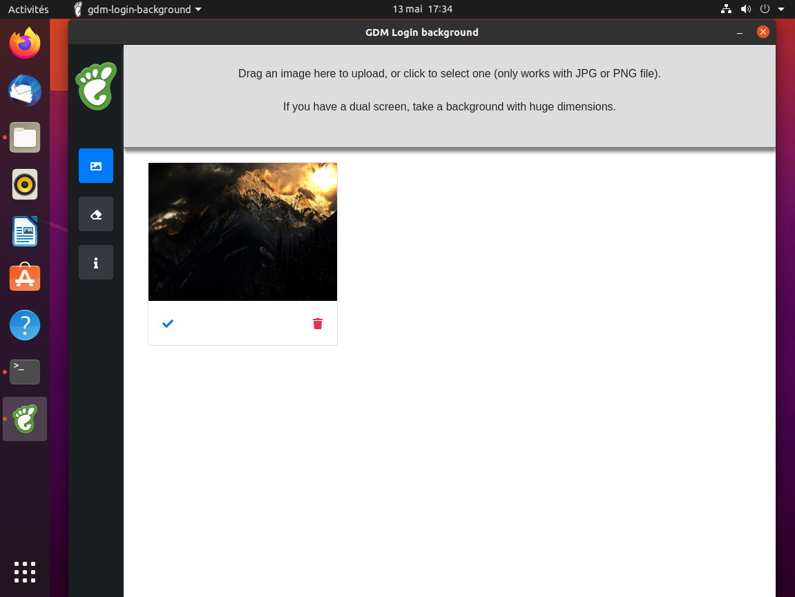
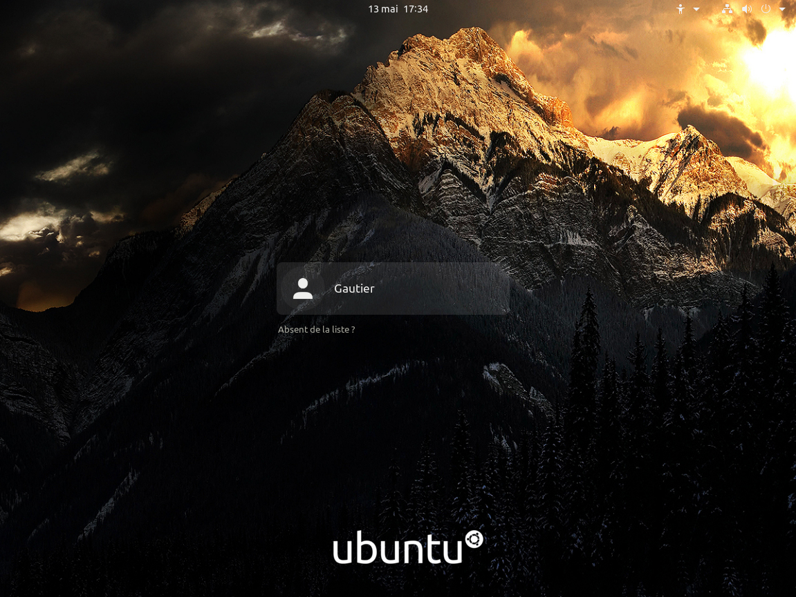

# GDM Login Background

<div align="center">

[Download appImage](https://labarre.me/gdm-background-login/gdm-login-background.AppImage)

 >>

</div>

## Aim
Simple project to change background on GDM Login screen for Ubuntu 21.10 and above.
It's should work on pop_os and derivates. As long as it's gnome 40 (and above ? to be tested)
IF you're using gnome 38 (ubuntu 20.04 until 21.04 : select this version [ADD LINK])

This action requires root password because the login background is the same for all users. 
So choose an Image carefully, but if you change your mind, this app allows you to RESET to the default background login.

## How to

1. Download the appImage [here](https://labarre.me/gdm-background-login/gdm-login-background.AppImage)
2. Move the appImage to the folder you want (if you delete the appImage file the software will be "uninstalled")
3. Right click on appImage, click on property then permission tab
4. Check the checkbox (like in [this picture](screenshots/give-permission.png))
5. Then double-click the appImage, you should [see this](screenshots/dependencies-install.png) 
6. If you do not have all the required dependencies, a message will be displayed, simply click the button and wait (your password will be asked).
7. Then simply click the gray area to add image OR just drag and drop a JPG OR PNG file from your file explorer
8. Click the check icon to select this image as login background
9. You'll have to enter your root password (the login background is the same for all users) 
10. A message will then ask you if you want to restart GDM Service (like [this](screenshots/restart-gdm.png))
11. If you click ```Restart GDM```, you'll be logged out and will see the next background, [example](screenshots/see-result.png)  
12. IF (in rare cases) you're not able to login, don't panic, just restart the computer it'll work fine.

## Want to help ?

**If you like this app, you can say "thanks" with [a coffee](https://ko-fi.com/gautierlabarre)**

or participate :

This app is written in Electron with SvelteJS framework.
I made this app in a hurry, there must be a lot of work still to do.
Feel free to fork and send a pull request.

Here are some ideas :
- i18n (i only wrote this in English, but i18n should be easy, with default system language)
- Check user uses the right version of gnome
- Change to Material design
- Dark theme
- This project uses a modified version of [this script](https://github.com/thiggy01/ubuntu-20.04-change-gdm-background), 
so, maybe write our own sh script.